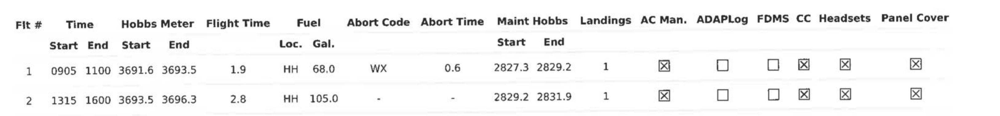

# Redaction-Detecting PDF Text Scraper

Structured text extraction from image-only PDFs using R and the ExtractTable API, detecting and inserting redactions within the text.

This program is built in particular for the format of the LAPD Air Support Division daily log format. It cannot be used with other formats of files without significant modification, although the code structure could be used as useful reference for building a similar PDF scraper for another file format.

For any questions, feel free to contact nikolas [at] ucla [dot] edu or nickshapiro [at] ucla [dot] edu.

TODO add table of contents

## Running

### Quick start

This is a an abbreviated guide to getting the program running. For more details, see the below sections.

-   Install [R and RStudio](https://posit.co/download/rstudio-desktop/)
-   Install the pdftools, magick, tidyverse, and tesseract R packages using `install.packages()` in RStudio console
-   Install [ImageMagick](https://imagemagick.org/script/download.php) on your command line
-   Acquire an [ExtractTable](https://extracttable.com/) "Extra" API key and put it in the `extracttable_api_key` variable
-   Download and open the project (using `git clone` or clicking "Download ZIP" after clicking the green "Code" button above)
-   Set the config options at the top of `src/main.R` and run the whole file
-   Copy your `logs` variable to the name you'd like (e.g., `logs <- logs_sept_20`)
-   Set the config options at the top of `src/toCSV.R` and run the whole file

### Dependencies

This is an R program; running it first requires installing [R and RStudio](https://posit.co/download/rstudio-desktop/).

After opening RStudio, open the console and install the required dependencies:

-   [pdftools](https://cran.r-project.org/web/packages/pdftools/index.html) to get PDF metadata
-   [magick](https://cran.r-project.org/web/packages/magick/vignettes/intro.html) for image manipulation (primarily cropping)
-   [tidyverse](https://www.tidyverse.org/) for common R syntax
-   [tesseract](https://cran.r-project.org/web/packages/tesseract/index.html) for local OCR processing

This can be accomplished by running the following command in the console:

```         
install.packages(c('pdftools', 'magick', 'tidyverse', 'tesseract'))
```

For in-text redaction detection (detecting black boxes), this R script uses the executable version of ImageMagick as it has more features than the R plugin. As such, you must have [ImageMagick installed](https://imagemagick.org/script/download.php)

-   You can verify whether ImageMagick is installed by running `magick -version` in your terminal. This should result in an info screen about the version installed, not a "command not found" error.
-   On macOS, the easiest method of installation is to install [Homebrew](https://brew.sh/) and then run `brew install magick` in a terminal.

Finally, this program uses an online web service/API called [ExtractTable](https://extracttable.com/) to recognize and extract structured table data from images, with built-in table detection and higher text recognition accuracy than locally. Acquire an API key for "Extra" credits -- you will need roughly 1.3x as many credits as pages of PDF you plan to extract data from, maybe more for testing.

### Configuration {#configuration}

Minimal configuration is necessary; options are at the top of the `main.R` and `toCSV.R` files in the `src` directory.

Within `main.R`, the options are:

-   `CALL_EXTRACTTABLE`: Whether to make API calls to ExtractTable while scraping the PDF; on a first run, you may wish to set this to FALSE (in tandem with below options) to ensure the PDF is being handled correctly, before using up API credits
-   `PDF_PATH`: The path to the PDF you'd like to extract data from
-   `PROMPT_AFTER_CROP`: Whether to display a "Press enter to continue" prompt after cropping each image; can be useful to step through PDF section cropping to ensure cropping captures the desired area
-   `SAVE_IMAGES`: Whether to save images of each cropped section, same purpose as above
-   `SAVE_IMAGES_PATH`: If `SAVE_IMAGES` is TRUE, path to folder to save images to (ensure this folder is created!)

Within `toCSV.R`, the only option is:

-   `logs_var_name`, which should be the name of the variable you saved the "logs" R data object to, generated in `main.R`. By default this is logs, although I would recommend renaming to something more descriptive, like the filename (e.g., `logs_sept_1`)

### Usage

This PDF scraper is split into two main files, both of which are R scripts to be run by hand:

-   `main.R`, the script to take in a helicopter flight log PDF and generate an R object with detected text and redactions, split into the sections of the PDF
-   `toCSV.R`, the script to convert the R object from above into a CSV file for use in further data analysis.

#### Extracting PDF data in main.R

Before running `main.R`, ensure the following:

-   Your ExtractTable API key is saved in the variable extracttable_api_key
-   Your path is set to the `src` directory with [setwd()](https://www.r-bloggers.com/2021/12/get-and-set-working-directory-setwd-getwd-in-r/)
    -   Alternatively, you may navigate to the `src` directory in the "Files" pane on the right in RStudio, then once inside the `src` directory, click the blue settings gear and select "Set As Working Directory"
-   You have configured the options as per the [Configuration](#configuration) section above

After opening and setting up `main.R`, simply run the file from top to bottom! The "Run" button in RStudio should work, or simply pressing Command + Enter on macOS, or Ctrl + Enter on Windows/Linux, through each line. Once you reach the "while" loop in the "MAIN CODE" section, the code will take some time to complete, as this is where it processes each page of the PDF in sequence. Be sure to run the last few lines of code; you should have a "Done!" message printed once the entire PDF has been processed.

Upon completion of the above, you should have a `logs` variable in RStudio. You can inspect it by hand by clicking on it in the Environment tab on the right.

-   I would suggest copying the variable to a name representative of the file it holds. For example, by running `logs_sep_1 <- logs` in the console.
-   You can save a copy of this R data formatted object with [saveRDS](https://rstudio-education.github.io/hopr/dataio.html#r-files) to keep it for further usage with R. If you're only interested in the CSV output, this is not necessary, but can be useful for debugging.
    -   For example, by running `saveRDS(logs_sep_1, file = "logs_sep_1.RDS")` in the console.

#### Converting PDF data to CSV in toCSV.R

To convert to CSV:

-   Open the `toCSV.R` file from `src`
-   Set the `logs_var_name` to the name of your log, from the previous step (see [Configuration](#configuration) section above)
-   Run the first few lines and the initial section of code with a "PRECHECK" comment
    -   If this section prints anything, there will be problems converting the R data to a CSV cleanly. Fixing this will require manually changing around the logs data and some R programming. Ideally, this should not print anything.
-   Run the remaining lines of code. This should save a CSV to the name of `logs_var_name` with a ".csv" extension -- go check it out!

## Examples

Check the `example` directory for example PDFs and their output after running them through these scripts. Each subdirectory is one example, with the following files included:

-   The original PDF file
-   An `.RDS` file containing the resulting `logs` variable from processing the PDF in `main.R`
    -   You can load the .RDS file in RStudio using [load](https://rstudio-education.github.io/hopr/dataio.html#r-files)
-   A `.csv` file with the output of converting the above `logs` variable to a CSV in `toCSV.R`

## Design

### Brief overview of main.R

The code itself is largely well-commented within, but a brief overview of the structure is as follows. The code is laid out into sections:

-   Configuration options, as described in the [Configuration](#configuration) section above
-   Accessory functions and setup (such as an enumerator to keep track of current file section)
-   A section for the more complex redaction detection code (see [Quantifying Redactions](#quantifying-redactions))
-   The main section, where pages of the PDF are processed sequentially and text/redactions are extracted

Within the main section:

-   The section is split into sections, each corresponding to a section within the PDF itself (e.g., the table at the beginning describing the overall "flights" of each log; the activites 'recap' section; and the activity descriptions section with more wordy descriptions). The structure of each section is very similar across sections, yet with enough difference that function calls for the "work" of each section would only make the code harder to understand.
-   A similarly uncommon design decision, there are many literals used within the code that, in general programming practice, would be better declared as named constants. However, each of these literals is used only once, and makes more sense in the context in which it is used (as the sections follow the flow of the PDF order). For debugging potential needs to change pixel offsets for different sections, it is thus more straightforward to edit these literals directly where they're used.

The result is a [logs variable](#logs-variable-data-format)!

### Brief overview of toCSV.R {#brief-overview-of-tocsv.r}

This file is split into two sections:

-   The initial section checks for some errors that may arise in the output of ExtractTable when detecting tables with potentially ambiguous column headers. It corrects common errors with column counts by adding, for example, dummy columns for data we are not concerned with outputting in toCSV.
    -   If there are any errors it cannot fix, this section will print them -- these should be addressed by the programmer programmer before running the next section of code
-   The second section coalesces the different logs into one large dataframe, suitable for conversion to CSV (the final file)
    -   This involves some more complex logic with, for example, guessing which activities line up to which flights based on times reported. Owing to the nature of the data we have, sometimes activities do not line up to flight times, or visa versa. As such, when building the CSV output, all flights and activities are logged, but sometimes they will not match up cleanly and the output will note this.

For sake of transparency, output from `toCSV.R` will sometimes include metadata about the process of generating a CSV, or when reporting special cases found in processing the file in `main.R`. The following are currently possible outputs that `toCSV.R` will place in the activity description column:

-   "\*\*\*no activities found to match flight #\*\*\*", when a flight is found with no activities to match it
-   "\*\*\*no activities recorded for this log\*\*\*", when an entire log has no activities recorded
-   "\*\*\*activity comments page missing for this log\*\*\*", when the entire activity comments page is missing
-   "\*\*\*activity comments redacted for this log\*\*\*", when all activity comments are redacted for the log

Additionally, since activities may not always match up to flights, sometimes the columns relevant to the flight will be set to blank or a `?` during joining. All recorded flights and activities will be logged at least once per log, though.

Two more potential activity comments descriptions come from the redaction detection step -- see [quantifying redactions](#quantifying-redactions) below.

### Quantifying redactions {#quantifying-redactions}

TODO including

-   imagemagick process
-   redactions w/in text
-   row/other redactions
-   how they're represented
-   prolly image examples same as slides

### Potential drawbacks

Some areas where this program could be improved upon include:

-   Redaction detection outside of activity comments section, e.g., within metadata sections. This wouldn't be too complicated, it was just not deemed necessary for this specific project.
-   Detecting checked versus unchecked boxes: this could likely be done locally by determining table bounds and cropping into the boxes, then using AI or even simple edge detection algorithms to find the bounds of the box, and then check whether the inside is entirely white or has a black 'x' inside. We have a data source for the data these boxes represent, so this feature was not developed, but could be useful.
-   Automation: this program is currently built for manually processing one PDF log at a time. Although this is leagues faster than manually entering data, it could be sped up further by enabling input of many PDFs to yield an output of many CSVs. This may be added in the future!
-   More broadly, this program is very specific to a certain format of PDF, down to the level of using specific pixel widths and heights, and groups of words, to detect sections within the flight logs. Although this works well for this purpose, it means that most of the program would have to be changed entirely to create a similar scraper for another format. (The overall structure could still be useful as a guide, though.) It could be useful, then, to abstract this program into a more broadly-applicable scraping tool that can handle a variety of formats of PDFs via configuration.

## Data formats

### logs variable data format {#logs-variable-data-format}

The logs variable is the intermediary between the main program, which extracts text and detects redactions, and the smaller secondary script, which converts this data to a CSV format. A logs variable is a list of each detected log on the PDF; each log itself is 2 to 4 PDF pages with different sections of the log:

-   `meta`: The metadata table at the top of the log with data pertaining to the whole log
-   `aircraft`: The "Aircraft Information" table with information about timing, mileage, and more of each "flight" within the log (generally 1 to 2 flights per log)
-   `recap`: The "Activities Recap" table with metadata about individual "activities"
    -   ExtractTable does not process this table well and we have another source for it, so in this program this table is primarily used for its activity start/end times. These are used in the process of matching activities to flights in CSV conversion.
-   `recap_end`: The text at the bottom of the recap section; largely ignored by us
-   `description_meta`: The text before the activity comments section
    -   Here a table `local_table` is created without ExtractTable since this text is redundant and well-read by the local OCR
-   `descriptions`: The most important component of this program! The activity comments section, with detailed text entries recounting each activity. Here, precise redaction detection is used to detect black boxes within the text

Each of the above variables has the following properties:

-   `image`: The name of the image file of this section (useful for reference if saving cropped images)
-   `local_ocr`: The local OCR using the tesseract package of the text within this section; contains only words and their locations, not a full table
-   `extracttable_ocr`: The table of text recognized via ExtractTable, with redaction detection if applicable
    -   Further containing a list with `table` — the table itself — and `response` — the full JSON response from ExtractTable, for debugging

Note that for `recap` and `descriptions`, the latter two variables above are plural and are lists of their respective data rather than a standalone, owing to the possibility of multiple pages of data.

Finally, each log contains the following variables in addition to each of the sections outlined above:

-   `log_meta`: A variable containing metadata about the log, including:
    -   `filename`: The PDF file's name
    -   `file_total_pages`: The PDF file's length, in pages
    -   `file_start_page` and `file_end_page`: The start and end pages to the current log
    -   `present_pages` and `num_pages`: If detected with local OCR, a list of all detected "present" pages and "total" pages from the "Page x of y" at the bottom of each page. Could be used to help determine if pages are missing from logs.
-   `specials`: A list of any unusual properties of this log. Currently, these could be:
    -   `NO_ACTIVITIES_RECORDED`: The activities section explicitly says "No activities recorded for this assignment"
    -   `SOME_MISSING_ACTIVITIES_RECAP`: The activities recap section must be missing some activities, because the scraper did not find the usual footer at the closing of this section
    -   `NO_ACTIVITIES_DESC`: There is no activity descriptions page
    -   `REDACTED_ACTIVITIES_DESC`: There is no text on the activity descriptions page; generally this means there is a redactions covering all the text
    -   `REDACTED_ACTIVITIES_DESC_CONTD`: Same as above, except on the second page of descriptions

### CSV output data format

The generated CSV has many column headers. Each comes from one, or multiple, of the [logs variable](#logs-variable-data-format) sections. The breakdown is as follows, using the example `23-8654-Final.pdf` log for example log and CSV photos.

#### Metadata section

-   The first 17 columns in the CSV match up one-to-one with the metadata table (`meta` log variable) at the top of the log
    -   date, watch, assign, ac_num, w/c, tfo, tfo_ser_num, tfo_on_duty, tfo_off_duty, pilot, pilot_ser_num, pilot_off_duty, co_pilot, co_pilot_ser_num, co_pilot_on_duty, co_pilot_off_duty
-   These columns are duplicated across all flights/activities to which they are relevant; most logs have many rows with the same info repeated as a result


... turns into ...


#### Description metadata

-   The next 5 columns are taken from the activity descriptions/comments section (`description_meta` log variable) and are given `full_` prefixes in the CSV as they are repeated or lengthier metadata info from the metadata section above. If the TFO or pilot is redacted before, they're likely redacted here too.
    -   full_tfo, full_pilot, full_date, full_watch, full_assignment
-   As before, these columns are duplicated across relevant flights/activities


... turns into ...


#### Aircraft information

-   The following 13 columns are from the aircraft information table (`aircraft` log variable). Note that the last six variables ("AC Man.", "ADAPLog", "FDMS", "CC", "Headsets", and "Panel Cover") from this section are not included as they are check boxes that ExtractTable nor local OCR can easily detect. We can also get this information, ideally, by cross-referencing with other public data, so it was not a priority to extract it.
    -   flight, flight_time_start, flight_time_end, hobbs_meter_start, hobbs_meter_end, flight_time, fuel_loc, fuel_gal, abort_code, abort_time, main_hobbs_start, maint_hobbs_end, landings
-   Each of these variables is per-flight; as a result, they are duplicated as necessary to span each activity a flight encompasses. Sometimes there are no matching activities, in which case the flight info is shown once and the activity description reflects this discrepancy. See the [design for toCSV.R](#brief-overview-of-tocsv.r) for more info.



... turns into (some rows hidden) ...


### Activity comments

-   The next four columns are taken from the activity descriptions section (`descriptions` log variable), where much of the interesting data and the word-level redaction detection feature shows up!
    -   act_no, location, area, comments
-   Since this variable is the smallest spanning data, there is no duplication of activity comments as with previous sections.

Note this example is from page 13 of the PDF, to show the redaction detection feature!


... turns into ...


Note that activity comments has a number of possible special cases, two of which are visible in the above example. One of them is that an in-text redaction was detected, which is replaced with [\*\*\*] as described in the [redaction quantification](#quantifying-redactions) section. All the others start and end with three asterisks, and have some special meaning:

-   `no activities found to match flight #x`: A flight is recorded, but its time does not overlap with any of the activities
-   `no activities recorded for this log`: The log explicitly states that no activities were recorded for the log in text
-   `activity comments page missing for this log`: The activity comments page is missing
-   `activity comments redacted for this log`: All activity comments are redacted
-   `redacted row(s) WxH pixels at (x, y) below i above j`: Detection that an entire row of activity comment(s) was redacted, with reference for where (should also be placed physically between non-redacted comments)
-   `unknown redaction WxH pixels at (x, y) below i above j`: Same as above, except the detection did not seem wide enough to be a row

### Activity times

-   Only two columns from the "Activities Recap" section (`recap` log variable) are preserved in the CSV output: activity start and end. These are used to match activity numbers to flights, based on flight time start/end. However, not all flight activity times lay within flight bounds as they should, so sometimes activities are without flights and/or flights are without activities. Since this timing is used in CSV generation, it is preserved almost as a metadata variable.
    -   act_time_start and act_time_end
-   As a result of matching based on this time variable, sometimes data related to the flight will be unknown for a given activity, and thus the `flight` column will have `?` instead.

### Metadata

-   The final seven columns are metadata generated by the PDF extraction process (`meta` log variable), described in more detail in the [logs variable data format](#logs-variable-data-format) section.
